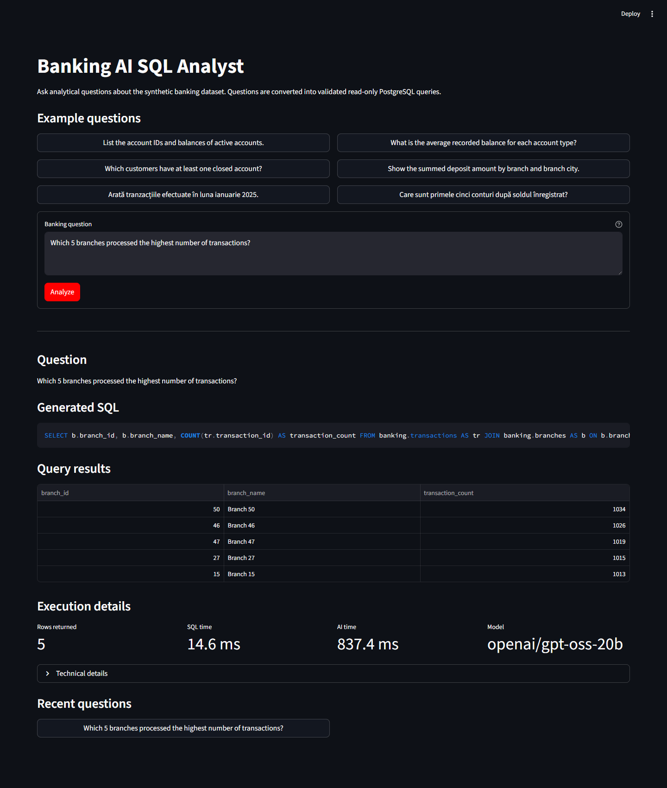
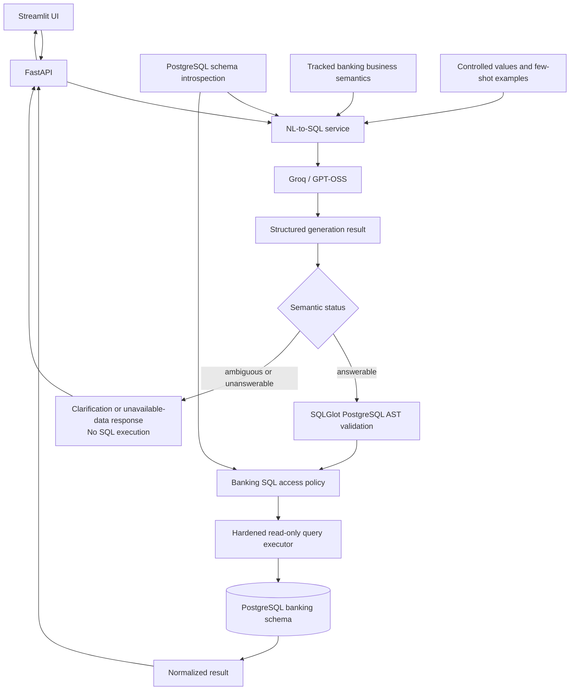
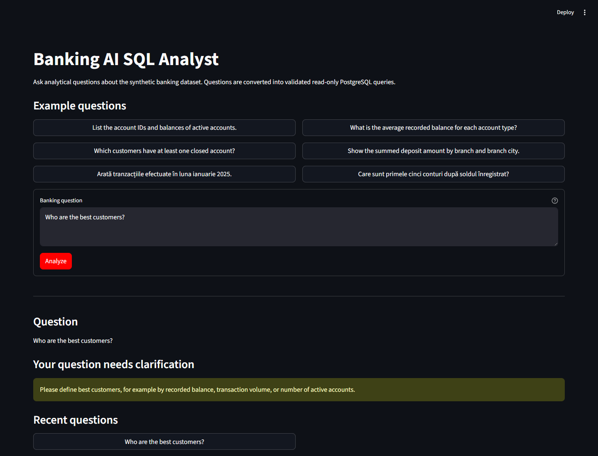

# Banking AI SQL Analyst

[](https://github.com/BennyS94/banking-ai-sql-analyst/actions/workflows/test.yml)
[](https://www.python.org/)
[](LICENSE)

Banking AI SQL Analyst converts English and Romanian banking questions into
schema-grounded PostgreSQL, validates generated SQL through an AST-based safety
layer, and executes only approved analytical queries through a least-privilege
read-only database role.



## What it does

The application combines a FastAPI backend, Streamlit frontend, and relational
PostgreSQL banking dataset. It provides:

- English and Romanian natural-language analytics;
- schema-aware NL-to-SQL generation grounded in live metadata and tracked
  banking semantics;
- structured `answerable`, `ambiguous`, and `unanswerable` outcomes;
- safety-validated SQL execution with visible generated/executed SQL;
- normalized tabular results plus generation and execution metadata.

Each question is independent. The model does not receive database credentials
or execute SQL directly.

## Architecture



The AI integration, SQL validation, execution, data ingestion, API, and UI
remain separate application boundaries.

## Engineering and SQL safety

LLM-generated SQL is treated as untrusted input. Defense in depth includes:

- SQLGlot parsing in the PostgreSQL dialect and exactly one executable
  statement;
- rejection of DML, DDL, administrative commands, data-modifying CTEs,
  `SELECT INTO`, row-locking clauses, cross-schema/system-catalog access,
  unknown objects, and unapproved functions;
- scope-aware CTE and alias resolution, with banking tables and columns checked
  against live schema introspection;
- a dedicated PostgreSQL runtime identity with `SELECT`-only access;
- an explicit read-only transaction, controlled search path, 5-second default
  `statement_timeout`, and a 500-row default cap using bounded fetching;
- at most one repair attempt for eligible PostgreSQL correctness errors.

Safety-policy failures are never repaired. Any repaired SQL must pass the full
AST and access-policy pipeline again before execution.

## Evaluation — 52-case NL-to-SQL benchmark

The tracked benchmark contains 52 cases: 35 English and 17 Romanian; 20 easy,
21 medium, and 11 hard; and 40 answerable, 7 unanswerable, and 5 ambiguous. It
covers filters, aggregation, joins, ranking, temporal queries, NULL semantics,
subqueries/CTEs, window functions, and semantic non-answer cases.

Correctness is based on normalized query-result comparison, not SQL-string
equality, so semantically equivalent SQL can receive credit.

| Metric | GPT-OSS 20B | GPT-OSS 120B |
| --- | ---: | ---: |
| Result accuracy | 71.05% | 71.05% |
| End-to-end accuracy | 73.08% | 75.00% |
| Romanian accuracy | 64.71% | 64.71% |
| Hard-case accuracy | 45.45% | 54.55% |
| Median generation latency | ~0.95 s | ~7.49 s |
| Total token usage | 137,105 | 145,087 |

The deterministic safety corpus blocked 41 / 41 adversarial SQL statements and
accepted 40 / 40 trusted legitimate statements: a 0% legitimate-query safety
false-positive rate in that corpus.

`openai/gpt-oss-20b` is the configured default because it produced nearly
identical measured correctness to 120B with materially lower median latency and
lower token usage. `openai/gpt-oss-120b` remains the evaluated comparison model.
Observed weak areas were temporal reasoning, window-function cases, NULL
semantics, and Romanian performance relative to English.

This finite evaluation snapshot is not a claim of production reliability. See
[the evaluation documentation](docs/evaluation.md) for methodology, artifact,
resume, reporting, and reproduction details.

## Application behavior

- Answerable questions generate SQL and reach PostgreSQL only after both safety
  layers approve them.
- Ambiguous questions return a clarification message without SQL execution.
- Questions requiring unavailable data or capabilities return `unanswerable`.
- Unsafe generated SQL is blocked before database execution.



## Quick start

### Prerequisites

- Python 3.11 or newer;
- Docker with Compose support;
- a Groq API key.

The examples below use PowerShell and the default PostgreSQL host port `5432`.
If that port is occupied, change `POSTGRES_PORT` and both database URLs to the
same available host port.

### Install and configure

```powershell
git clone https://github.com/BennyS94/banking-ai-sql-analyst.git
cd banking-ai-sql-analyst
python -m venv .venv
.\.venv\Scripts\Activate.ps1
python -m pip install -e ".[test]"
Copy-Item .env.example .env
```

Edit the untracked `.env` file with development-only values:

```dotenv
GROQ_API_KEY=<GROQ_API_KEY>
GROQ_MODEL=openai/gpt-oss-20b
POSTGRES_PASSWORD=<OWNER_PASSWORD>
POSTGRES_PORT=5432
DATABASE_URL=postgresql+psycopg://banking_owner:<OWNER_PASSWORD>@localhost:5432/banking_ai
BANKING_READER_USER=banking_reader
BANKING_READER_PASSWORD=<READER_PASSWORD>
BANKING_READER_DATABASE_URL=postgresql+psycopg://banking_reader:<READER_PASSWORD>@localhost:5432/banking_ai
```

Never commit the populated `.env`. Export the data-management settings for the
current PowerShell session because those CLI commands read process environment
variables:

```powershell
$env:DATABASE_URL = "postgresql+psycopg://banking_owner:<OWNER_PASSWORD>@localhost:5432/banking_ai"
$env:BANKING_READER_USER = "banking_reader"
$env:BANKING_READER_PASSWORD = "<READER_PASSWORD>"
$env:BANKING_READER_DATABASE_URL = "postgresql+psycopg://banking_reader:<READER_PASSWORD>@localhost:5432/banking_ai"
```

### Build the data foundation

```powershell
docker compose up -d postgres
docker compose ps
python -m banking_data.cleaning --raw-dir data/raw --output-dir data/processed
python -m alembic upgrade head
python -m banking_data.loading --processed-dir data/processed
python -m banking_data.role_management
```

Wait for `docker compose ps` to report PostgreSQL as healthy before running the
Python commands. Optionally verify the complete data and privilege boundary:

```powershell
python -m banking_data.integrity --raw-dir data/raw --processed-dir data/processed
```

### Run the application

Start FastAPI:

```powershell
python -m uvicorn backend.app.main:app --reload
```

In a second activated terminal, start Streamlit:

```powershell
$env:API_BASE_URL = "http://localhost:8000"
python -m streamlit run frontend/app.py
```

Open `http://localhost:8501`. Detailed lifecycle, reset, and troubleshooting
instructions are in the [development database guide](docs/development_database.md)
and [data foundation workflow](docs/phase_1_workflow.md).

## Public API

| Method | Path | Purpose |
| --- | --- | --- |
| `GET` | `/health` | Report FastAPI process health. |
| `GET` | `/api/v1/database/schema` | Return typed metadata for the approved banking schema. |
| `GET` | `/api/v1/examples` | Return public English/Romanian example questions without SQL. |
| `POST` | `/api/v1/query` | Generate, validate, and conditionally execute one banking question. |

Interactive OpenAPI documentation is available at `http://localhost:8000/docs`
while the backend is running.

## Dataset

The project uses a 100% synthetic finance/banking dataset generated with
[TestDataBox](https://testdatabox.com/?utm_source=kaggle). It contains no real
customer data and includes 11 source CSV files, approximately 50,000 transaction
rows, and deliberately introduced data-quality noise.

Raw CSV files are treated as immutable. The cleaning pipeline deterministically
rebuilds processed data, diagnostics, and rejected-row outputs separately. See
the tracked [dataset attribution and description](data/raw/readme.md). The data
is licensed under CC BY 4.0.

## Testing and CI

The repository contains 200+ deterministic tests spanning offline unit tests,
PostgreSQL integration tests, API/end-to-end regressions, adversarial SQL safety,
and evaluation/reporting behavior.

The [Deterministic tests workflow](.github/workflows/test.yml) runs on pushes and
pull requests with Python 3.13 and PostgreSQL 17.11. It compiles the Python
packages, checks installed dependencies, applies Alembic migrations, and runs
the complete suite. Deterministic CI does not require a Groq key; provider
responses are faked. Live model evaluation remains an explicit, separate
workflow.

Run the complete local suite with a configured PostgreSQL owner URL:

```powershell
$env:BANKING_TEST_OWNER_DATABASE_URL = "postgresql+psycopg://banking_owner:<OWNER_PASSWORD>@localhost:5432/banking_ai"
python -m unittest discover -s tests -v
```

## Project structure

```text
backend/        FastAPI, NL-to-SQL, SQL safety, query execution, evaluation
banking_data/   Raw-data audit, cleaning, loading, roles, integrity checks
frontend/       Streamlit UI and FastAPI client
migrations/     Alembic migrations for the PostgreSQL banking schema
data/           Immutable synthetic source data and generated outputs
tests/          Unit, PostgreSQL integration, and regression tests
docs/           Detailed technical and operational documentation
```

## Scope and limitations

- The dataset is synthetic and the application is intended for portfolio and
  engineering evaluation, not real banking decisions.
- Analysis is single-turn; there is no conversational memory.
- V1 has no user authentication, RAG/vector database, or model fine-tuning.
- The finite benchmark does not prove production reliability.
- Measured weaknesses remain in some temporal, window-function, NULL-semantics,
  and Romanian cases.

## Technical documentation

| Document | Purpose |
| --- | --- |
| [Development database](docs/development_database.md) | Docker Compose setup, lifecycle, testing, and reset. |
| [Database schema](docs/database_schema.md) | Alembic-managed relational model and migration commands. |
| [Data cleaning](docs/data_cleaning.md) | Deterministic transformation and reconciliation contract. |
| [Data loading](docs/data_loading.md) | Transactional processed-data validation and loading. |
| [Data integrity workflow](docs/phase_1_workflow.md) | End-to-end rebuild and integrity validation sequence. |
| [Read-only role](docs/read_only_role.md) | Least-privilege analytical PostgreSQL role provisioning. |
| [Query backend](docs/query_backend.md) | FastAPI, schema introspection, and runtime execution boundary. |
| [NL-to-SQL generation](docs/nl_to_sql_generation.md) | Structured Groq generation and offline/live checks. |
| [Evaluation](docs/evaluation.md) | Benchmark execution, result comparison, reporting, and resume behavior. |

## License and data attribution

Project source code is available under the [MIT License](LICENSE). The synthetic
dataset is separately licensed under CC BY 4.0 and retains its original
[TestDataBox attribution](data/raw/readme.md).
